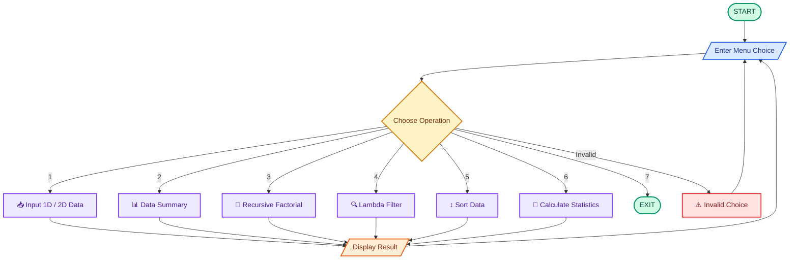
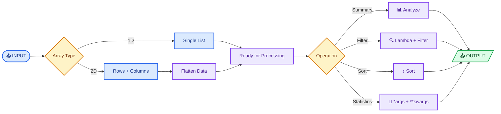

# 📊 Data Analyzer & Transformer

> **A menu-driven Python application for entering, analyzing, filtering, sorting, and transforming 1D and 2D numerical datasets.**

---

## 📌 About the Project

**Data Analyzer & Transformer** is a beginner-friendly Python console application created to practice core programming and data-processing concepts.

The program allows the user to:

- 📥 Enter **1D or 2D numerical data**
- 📊 Generate a **data summary**
- 🔁 Calculate **factorial using recursion**
- 🔍 Filter values using **Lambda + `filter()`**
- ↕️ Sort data in **ascending or descending order**
- 🧮 Calculate statistics using **`*args` and `**kwargs`**

The application follows a continuous **menu-driven structure**, so multiple operations can be performed without restarting the program.

---

# ✨ Features

| Option | Feature | Description |
|---:|---|---|
| `1` | 📥 Input Data | Enter a 1D or 2D numerical dataset |
| `2` | 📊 Data Summary | Calculate total elements, minimum, maximum, sum and average |
| `3` | 🔁 Factorial | Calculate factorial using recursion |
| `4` | 🔍 Filter Data | Filter values greater than or equal to a threshold |
| `5` | ↕️ Sort Data | Sort data in ascending or descending order |
| `6` | 🧮 Dataset Statistics | Calculate and display multiple statistics |
| `7` | 🚪 Exit | Exit the application |

---

# 🎯 Main Program Flow



---

# 🧩 Data Processing Flow

The program supports both **1D and 2D datasets**. When analysis, filtering, sorting, or statistics are performed on 2D data, the rows are flattened into a single list for processing.



---

# 📥 1. Input Data

The `input_data()` function supports two types of datasets.

### 1D Array

Example:

```text
Enter data for a 1D array (separated by spaces): 10 20 30 40 50

Data: [10, 20, 30, 40, 50]

Data has been stored successfully!
```

### 2D Array

The user enters the number of rows and columns, then provides values for each row.

Example:

```text
Enter number of rows: 2
Enter number of columns: 3

Enter values for Row 1: 10 20 30
Enter values for Row 2: 40 50 60

2D Data:
[10, 20, 30]
[40, 50, 60]
```

The program checks that every row contains exactly the requested number of values.

---

# 📊 2. Data Summary

The summary option uses Python built-in functions to calculate:

| Statistic | Function / Logic |
|---|---|
| Total elements | `len()` |
| Minimum | `min()` |
| Maximum | `max()` |
| Total sum | `sum()` |
| Average | `sum() / len()` |

For 2D data, the rows are flattened before performing the calculations.

### Example

```text
Data:
[10, 20, 30, 40, 50]

Data summary:
- Total elements: 5
- Minimum value: 10
- Maximum value: 50
- Sum of all values: 150
- Average value: 30.0
```

---

# 🔁 3. Factorial Using Recursion

The program calculates factorial through a recursive function.

### Example

```text
5! = 5 × 4 × 3 × 2 × 1
   = 120
```

The function stops when:

```python
n == 0
```

or

```python
n == 1
```

and returns `1`.

### Core Concept

```python
return n * factorial(n - 1)
```

This demonstrates how a function can call itself until it reaches a base condition.

---

# 🔍 4. Filter Data by Threshold

The program uses:

```python
filter(lambda x: x >= user, user_data)
```

This means a value is included when it is **greater than or equal to** the entered threshold.

### Example

```text
Data:
[10, 25, 40, 55, 70]

Threshold:
40
```

Output:

```text
40, 55, 70
```

### Concepts Used

- `filter()`
- `lambda`
- `map()`
- List conversion

---

# ↕️ 5. Sort Data

The user can choose between two sorting orders.

| Choice | Order | Python Method |
|---:|---|---|
| `1` | Ascending | `sort()` |
| `2` | Descending | `sort(reverse=True)` |

For a 2D dataset, the program creates a flattened list before sorting.

---

# 🧮 6. Dataset Statistics

This feature demonstrates several important Python concepts.

### `*args`

```python
def statistics(*args):
```

`*args` allows the function to receive multiple numerical values.

The function calculates:

- Minimum
- Maximum
- Total
- Average

### Multiple Return Values

```python
return minimum, maximum, total, average
```

The returned values are unpacked using:

```python
minimum, maximum, total, average = statistics(*user_data)
```

### `**kwargs`

```python
def display_statistics(**kwargs):
```

This allows named statistics to be passed to the function.

Example:

```python
display_statistics(
    minimum=minimum,
    maximum=maximum,
    total=total,
    average=average
)
```

---

# 🧠 Python Concepts Demonstrated

| Concept | Purpose |
|---|---|
| `while` loop | Keeps the menu running |
| `for` loop | Handles rows and repeated operations |
| `if / elif / else` | Decision making |
| `list` | Stores numerical data |
| Nested lists | Represents 2D data |
| `input()` | Takes user input |
| `int()` | Converts input to integers |
| `map()` | Converts input values |
| `split()` | Separates space-delimited input |
| `min()` / `max()` | Finds extreme values |
| `sum()` | Calculates total |
| `len()` | Counts elements |
| `isinstance()` | Detects 2D nested data |
| List comprehension | Flattens 2D data |
| `filter()` | Filters values |
| `lambda` | Defines the filtering condition |
| `sort()` | Sorts values |
| Recursion | Calculates factorial |
| `*args` | Accepts multiple positional values |
| `**kwargs` | Accepts named values |
| Multiple return values | Returns several results from one function |
| `global` | Updates the main dataset |

---

# 📊 Feature Summary

| Feature | Input | Main Concept | Output |
|---|---|---|---|
| 📥 Input Data | 1D / 2D values | Lists, loops, `map()` | Stored dataset |
| 📊 Data Summary | Dataset | Built-in functions | Basic statistics |
| 🔁 Factorial | Integer | Recursion | Factorial |
| 🔍 Filter | Dataset + threshold | `filter()` + `lambda` | Matching values |
| ↕️ Sort | Dataset + order | `sort()` | Sorted values |
| 🧮 Statistics | Dataset | `*args` + `**kwargs` | Multiple statistics |
| 🚪 Exit | Menu choice | `break` | Program ends |

---

# 🖥️ Sample Output

```text
Welcome to the Data Analyzer and Transformer Program

Main Menu:
1. Input Data
2. Display Data summary (built-in function)
3. Calculate factorial (Recursion)
4. Filter Data by Threshold (Lambda Function)
5. Sort Data
6. Display Dataset Statistics (Return Multiple Value)
7. Exit Program

Please enter your choice: 1

Choose Array Type:
1. 1D Array
2. 2D Array

Enter your choice: 1

Enter data for a 1D array (separated by spaces): 10 20 30 40 50

Data: [10, 20, 30, 40, 50]

Data has been stored successfully!
```

### Statistics Output

```text
Dataset Statistics:
minimum : 10
maximum : 50
total : 150
average : 30.0
```

---

# 📂 Project Structure

```text
Data-Analyzer-and-Transformer/
│
├── main.py
├── README.md
│
├── screenshots/
│   └── output.jpg
│
└── video/
    └── project-demo.mp4
```

> Replace `main.py` with your actual Python filename.

---

# 🛠️ Technologies Used

| Technology | Purpose |
|---|---|
| 🐍 **Python 3** | Core programming language |
| 💻 **Python IDLE / IDE** | Development and execution |
| 📦 **Built-in Python Functions** | Data processing and analysis |
| 🚫 **External Libraries** | Not required |

---

---

# 📸 Project Output

Add your screenshot to the repository:

```markdown

```

<p align="center">
  
</p>

---

# 🎬 Video Demonstration

**▶️ Project Demo:**  
`<your-video-link>`

---

---

# 🎯 Project Objectives

This project was created to practice how different Python concepts can work together in a practical application.

### Learning Goals

- Understand 1D and 2D list structures.
- Practice loops and conditional statements.
- Use built-in functions for data analysis.
- Understand list comprehension.
- Practice `filter()` and `lambda`.
- Understand recursion through factorial.
- Practice `*args` and `**kwargs`.
- Return and unpack multiple values.
- Perform basic data transformation.
- Build a menu-driven console application.
- Improve programming logic and problem-solving skills.

---

# 📌 Project Details

| Detail | Information |
|---|---|
| **Project Name** | Data Analyzer & Transformer |
| **Project Type** | Python Mini Project |
| **Application Type** | Console / CLI |
| **Language** | Python 3 |
| **Level** | Beginner / Intermediate Practice |
| **Data Supported** | 1D and 2D numerical lists |
| **Main Concepts** | Functions, loops, recursion, lambda, sorting, built-ins |
| **External Libraries** | None |
| **Data Storage** | Runtime memory |

---

# 🏆 Key Learning

This project combines multiple Python concepts into one practical workflow:

```text
        📥 COLLECT
            ↓
       🔄 TRANSFORM
            ↓
        📊 ANALYZE
            ↓
       🔍 FILTER / SORT
            ↓
        🧮 CALCULATE
            ↓
        📤 DISPLAY
```

### Core Workflow

**Collect → Transform → Analyze → Display**

The project provides hands-on practice with **data handling, functions, recursion, functional programming concepts, sorting, and basic statistical calculations**.

---

# 🤝 Contributing

Suggestions and improvements are welcome.

1. Fork the repository.
2. Create a new branch.
3. Make your changes.
4. Test the program.
5. Commit your changes.
6. Open a Pull Request.

---

---

# 👩‍💻 Author

**dhara**

*Python Learner • Learning by Building* 🐍

---
---

<div align="center">

## 📊 Data Analyzer & Transformer

**Collect → Transform → Analyze → Understand**

🐍 **Built with Python**

</div>
